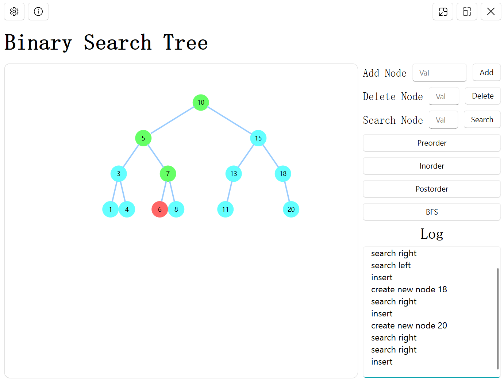
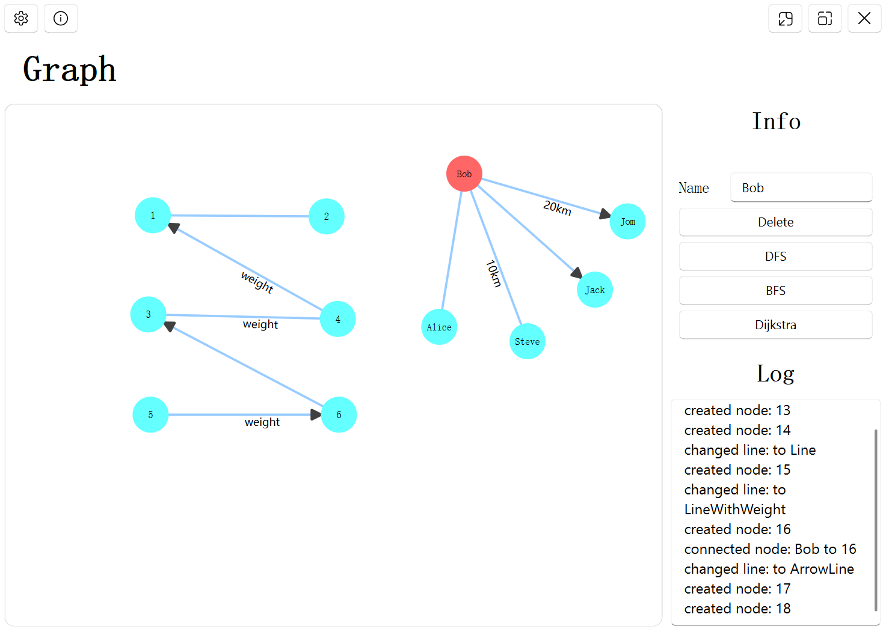
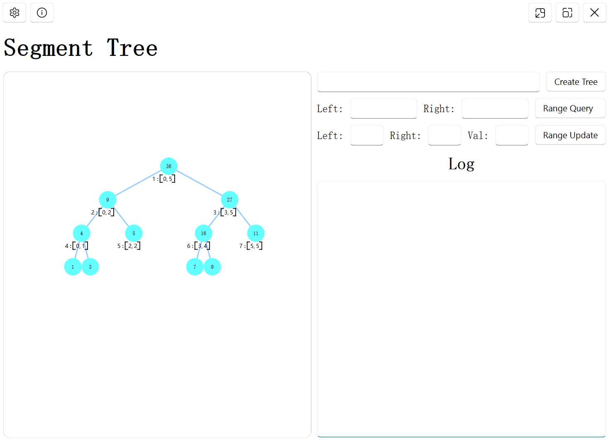

# 								Data-SGV

**Data structure visualization based on PySide6**

Visualization of data structure makes it easier for students to learn data structure and greatly improves the degree of freedom

## Supported data structures

1. Binary tree
2. Binary search tree
3. Graph
   1. Undirected graph
   2. directed graph
4. Segment tree

## Future support data structures

1. Heap
2. Stack
3. Hash
4. Linked list
5. Disjoint-set

## Run

:\Data-SGV\main.py

## Video Demonstration

...

## Data structure image

Binary search tree

Graph

Segment tree

